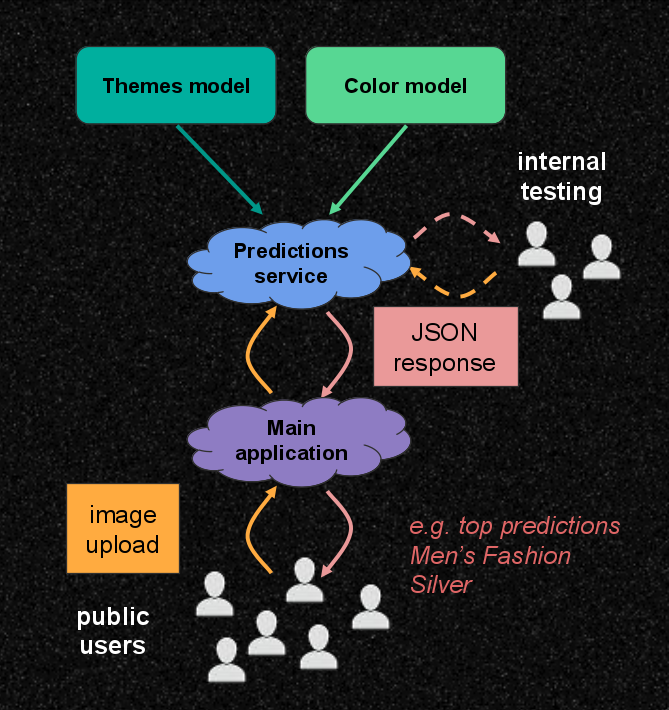
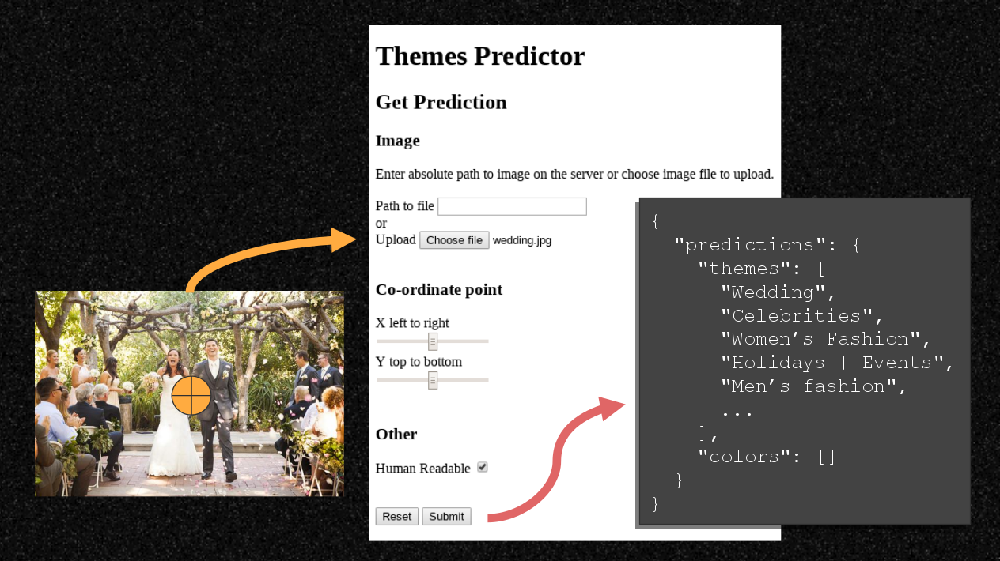

# TensorFlow on a Web API

_2018, Feb 20th_

  

You've trained your [deep learning](https://machinelearningmastery.com/what-is-deep-learning/) algorithm to accurately label images, but what _next_? 

One way to get it to add value in a production environment is to integrate your predictions service into a [REST API](https://www.mulesoft.com/resources/api/what-is-rest-api-design) web server! And if you don't have one yet, you can built one using a light-weight Python framework (see the [Further Reading](#further-reading) section). As a web server, it can be accessible in the browser for your colleagues on the network, you can implement it as backend component of your company's main application, or even offer it as a public service on the internet (similar to [IBM Watson](https://watson-api-explorer.mybluemix.net/) or [Cloudsight](https://cloudsight.ai/api)).

This article aims to provide a case study on how to implement an image classification algorithm on a web server. I've added some advice to get you started and some opportunities and pitfalls to look out for. The content is targeted at Python developers who have an interest in machine learning and/or web APIs. However, the focus is on the principles rather than the code, to make the content accessible for a wider audience.

_Contents_

- [Context](#context)
- [Business need](#business-need)
- [Implementation](#implementation)
- [Challenges and learnings](#challenges-and-learnings)
- [TD;DR](#tldr)
- [Further reading](#further-reading)
- [Attribution](#attribution)

## Context

While working as a Python developer at [Curately](https://curate.ly), I was given the opportunity to design and build what became known as the _Data Science API server_, or the _"DS API"_. I worked closely with my colleague from the Data Science department, Jaco du Toit. He provided me with the trained models and command-line prediction scripts to get me started. 

We built this project on open-source technology and resources, so we love to share our discoveries with others. After the _DS API_ was implemented, Jaco asked me to be a speaker at his [Deep Learning Workshops](https://deeplearningworkshops.com/) series (in Cape Town, South Africa). In the talk I gave there, I covered the principles we followed in building the _DS API_, while sharing some challenges and learnings which stood out to me. This article is based on that talk. 

## Business need

The requirement for the _DS API_ project was to enable users to upload images to the service, specify a pair of X and Y co-ordinates (representing a point on the image) and to then respond with the top 5 most relevant themes and top 5 most relevant colors as appropriate labels for that point. 

There were fixed sets of 42 themes (such as _"Women's Fashion"_, _"Gardening"_ or _"Architecture"_) and 18 colors (such as _"blue"_, _"silver"_ or _"multi-colored"_). The aim was to provide these predicted labels as accurately and quickly as possible, in order to improve the user's experience of creating and labeling content in the main application's service.

## Implementation

### Model files

It was great for me to first test and understand the project's most basic components, then build the API functionality around them.

I was supplied two trained TensorFlow "model graph" files, which are both category classifiers.

- `themeClassifier.pb` (created as a _Convolutional Neural Network_)
- `colorClassifier.pb` (created as a _Recurrent Neural Net_)

I was also supplied theme prediction script and a color prediction script. These Python scripts expected a path to an image, cropped it, printed the prediction results in the terminal and then exited.

When doing a prediction, the model expects an image which has been cropped around the co-ordinate points. We found that around 80% of the original image gives good accuracy for theme predictions. While a 9x9 pixel cropped portion of the image is the required input for the color model. The model prediction returns a set of all the model's output node IDs, which are ordered from most to least relevant (these then be filtered to the top 5 values to show to the client). These IDs can be mapped to human-readable labels in a text file. The probabilities associated with each label are also outputted, to give an idea of how confident the model is in the prediction. These are useful for internal testing and were not shown to the user for this project.

### Predictions service

The _DS API_ service which I built is a Python web server which does following:

1. Read the static model graph files into memory on start-up, using TensorFlow.
2. Start a [CherryPy](http://docs.cherrypy.org) web API server, including a [POST](https://en.wikipedia.org/wiki/POST_(HTTP)) endpoint which handles a prediction.
3. Receive a client request with an image and a set of X and Y co-ordinates in the body of the request - see _Improve Testing_ in the next section for more details.
4. Create a cropped image (using [Pillow](https://pillow.readthedocs.io/en/latest/)) for color prediction input.
5. Run a color prediction.
6. Create a cropped image for theme prediction input.
7. Run a theme prediction.
8. Nest the color and theme predictions within a dictionary and return it as a JSON object to the client.

The _DS API_ appears as the _Predictions service_ in the system diagram below. The orange arrows show the flow of the input image and co-ordinate data, while the red arrows show the flow of the response data.

## Challenges and learnings

Below are the most valuable lessons I learned in this project.

### Adapt

Be adaptable with your service, gradually building up layers of complexity and ways to test them. You can always go back and test one of the simpler layers whenever you need to isolate a bug or find an area to improve.

Here are steps I followed to build up the layers:

1. Test and refactor a simple command-line prediction script.
2. Create and test the REST API part of the service.
4. Add a basic HTML form to the API service, for easy testing in the browser - see [Make testing easy](#make-testing-easy) below.
5. Deploy the prediction service on a remote development server. Test the REST API and the HTML form.
6. Integrate the predictions service within the main application and test the main application layer.
7. Deploy to the production environment.

Seek to improve how your service handles memory, so you get optimal prediction times. In computing, reading from a file on the hard disk is relatively slow, compared with reading from memory. The theme model was about 80MB and on the first iteration of the project this was read into memory (which took a few seconds), whenever it was needed for a prediction, then it was released from memory. When the next request was made, this would happen again. But, I found that the service returned request data to the client much quicker when I moved loading of models to server start-up and then reused the models in memory on all requests. This might not work in all projects, but it definitely made a difference for this one. If you are using _TensorFlow_, I highly recommend you read up how on to use _Sessions_ can be used manage your models and predictions to give optimal prediction times and memory management. See the [Further Reading](#further-reading) section.

### Make testing easy

If you are going to easily and regularly test the layers described in the previous section, it's a good idea to use testing methods which make your life as a developer easy.

With the initial REST API created, I tested the endpoints manually, to check accuracy and times. I sent an image and co-ordinate values with a command-line command. I used two approaches:

- [cURL](https://www.rosehosting.com/blog/curl-command-examples/) in the bash terminal - see an article on uploading files with cURL [here](https://medium.com/@petehouston/upload-files-with-curl-93064dcccc76).
- [Python requests](http://docs.python-requests.org/) package - see a guide to send a file on a POST [here](http://docs.python-requests.org/en/latest/user/quickstart/#post-a-multipart-encoded-file).

I then wrote a bash script which called the various endpoints on the API, to ensure they returned an appropriate success or failure response based on a given image and co-ordinate arguments (or possibly bad or missing data).

I recommend creating some kind of easy user interface hosted on the server, which you and other staff can use to test. In my project, I created a basic HTML web form, located as a path on the _DS API_. This interface can be used to conveniently upload an image on the user's machine with co-ordinates. When a user clicks the submit button, a POST request is sent to the services endpoint and the response is shown in the browser. 

An example flow with the form:

That is very easy for non-technical users to use, meaning that you can get more staff and stakeholders to try out the service themselves before it gets integrated into production. Get feedback from these users to you help identify patterns, such as areas were the accuracy or performance times are very strong or weak. 

### Integrate safely

When you integrate your predictions service into a larger API or service, consider how to make the system robust, so that the user experience is not broken when one element fails.

#### Performance of the entire system

Look at various real-world scenarios, such as when a single model is used in a prediction, compared with using multiple models to give predictions. On a request, is it more effective to run the predictions as parallel requests, or in series? You will have to look at your situation and run experiments to answer this. 

Don't just measure the time for your predictions service when used alone. If your service fits in as part of a larger service of uploading and labeling images and getting the results, what is the total request time from the user's perspective and is this realistic?

#### Stability

Consider how your predictions service might fail to give results to a user or your main application, then build in logic around this to achieve stability. For example, if the prediction service is turned off, it failed to start, or has a bug on a prediction. Write logic into the predictions service to appropriately handle unexpected input, such as a bad or missing data or a massive image file. Consider forcing the service to raise a timeout error internally if the duration of the predictions service (or the main application service) request takes a longer than a maximum cutoff time which you think is reasonable for the user to wait.

Add in escape logic in the main application so that if the predictions service fails for reasons such as one the above, it can still return default or empty data for the predictions part of the response, instead of aborting and giving the user an error.

### Optimize for production

You can do a lot of useful testing on your local development environment. But remember to test it when it is configured to run like a remote environment. Then later, actually test your service when it has been deployed on a remote development server.

#### Daemonizing

When running your API on a remote server on production, it will likely be running as a background process or "daemon", such that it can run after the command-line terminal is closed and also so that process can be stopped and started by other developers on the server. 

I found that when switching daemon mode on, that I got a strange error. The _TensorFlow Session_ could not find the model in memory. I worked out that this was because the model and the prediction Session were running on _different threads_ (read up on threading in Python or CherryPy if you're interested in this). I had to experiment and research the approach of other people on sites like StackOverflow. I found a way to ensure the resources were on the same thread and that I was managing the resources well. A drawback of the solution is that it means the prediction time became slightly slower, but, at least it now runs when in daemonize mode.

#### Hardware

Test and benchmark the prediction service times on your local environment and compare those with times on a remote environment. I found that I might get 1 to 2 seconds on my local environment (since it was running on a [virtual machine](https://en.wikipedia.org/wiki/Virtual_machine)), the prediction time was more like half a second on the remote server (which has different hardware and is not running a VM).

#### Scaling

If your service is expected to have many users doing simultaneous requests to your server, consider how to simulate this behavior when testing. Also, if you can build any improvements to balance the incoming requests or the use of memory. Perhaps you should load the same model multiple times on startup, or maybe duplicate it across threads which are allocated to users. Look at adding a load-balancing service like [nginx](https://www.nginx.com/) in front of your web server.

### Access

Protect against you service being abused by users giving bad data or excessive data, whether intentionally or accidentally. Consider putting a limit on the frequency of requests coming from one user and also limit the dimensions, file size and format of images. Depending on your project, you might want to restrict public access to your service, or require authorization to use it.

### Learn from the feedback loop

Logging of events and performances is important for a project like this, as it can help tell you where you need to make improvements and if the improvements you made were effective or not.

#### Performance

Decide on performance metrics and then log them in your server's log files. Log each prediction and which model was used, not just the request to the endpoint. In the message, include the duration to do the prediction. Maybe also log the time it takes to load the model in memory.

Create benchmarks based on actual values - make a note of the average duration time you observe, then when you implement a change, make a note of the new times you see. Set a target for the performance times you want to achieve. Observer how the metric values are influenced by several factors, such as increasing the number of requests, using a new version of an existing model, increasing the count or file size of models, changing your Session approach or turning daemonizing on and off.

#### Accuracy

Ultimately, having a fast service means nothing if it doesn't give value for the user. Record the prediction results and accuracy of your predictions service, whether using an automated test, or at least tests by hand.

Compare the accuracy of the model in different levels. Using the set of test images, perhaps the service's top 5 predicted themes are appropriate for 90% of cases and 75% of the time the top 1 item is appropriate. But when using real world images from users, you might discover that these values drop. Perhaps the labels in your system are two similar for a real user to choose between and should be combined into a single category. 

Perhaps the color service gets the top 5 items correct 92% of the time, but it performs much worse on certain colors. In this for example, the initial iteration of the color classifier performed poorly on obscure items like silver, rose gold, multi-colored or black & white. But the model was revised and it was retrained using more images with these hard to identify colors. Then performed much better on those items.

Your service might perform well on a set of test images you sourced, but does it provide value in a real life situation? Look at logging what your service predicted and also record what the _users actually choose_ from the selection, to see if they accept or rejected the suggestion. This can help provide feedback for improving the model, or the images and labels it is trained.

If the user overrides the suggestion by choosing something outside of the recommended top 5 values, perhaps your model is not as accurate as you thought, or users are uploading images which are very different from the images you used in training. Or possibly the choice of labels on your training data is very different to how your real-world users assign labels, due to language, social or cultural differences.

## TL;DR

When you take your machine learning algorithm out of development and productionize it, I recommend integrating it as part of an web server API in order to make it accessible. 

Think about the approach from a few angles. Make sure you think about how your service can work alone as well as as part of a larger system. In both environments, ensure that you test the service thoroughly and that you record the accuracy and duration values as performance benchmarks. Set targets for those metrics and then research and experiment to help you reach them. And always ask yourself whether your service is actually meeting a real need for a user or customer and how you can do this better.

## Further reading

- CherryPy docs
    * [homepage](http://docs.cherrypy.org)
    * Deploy section - [Run as a daemon](http://docs.cherrypy.org/en/latest/deploy.html#id6)
- Flask docs
    * [homepage](http://flask.pocoo.org/)
- TensorFlow
    * [homepage](https://www.tensorflow.org)
    * [TensorFlow Session docs](https://www.tensorflow.org/api_docs/python/tf/Session) and ["What is a TensorFlow Session?"](https://danijar.com/what-is-a-tensorflow-session/)
    * [TensorFlow Serving](https://www.tensorflow.org/serving/) - _"... a flexible, high-performance serving system for machine learning models, designed for production environment."_
    * [Tensor2Tensor](https://github.com/tensorflow/tensor2tensor) - _"... a library of deep learning models and datasets designed to make deep learning more accessible and accelerate ML research."_
- Tutorials
    * ["Deploy TensorFlow models in Flask"](https://github.com/benman1/tensorflow_flask)
    * [TensorFlow-Tutorials](https://github.com/Hvass-Labs/TensorFlow-Tutorials) repo - in particular, see [inception.py](https://github.com/Hvass-Labs/TensorFlow-Tutorials/blob/master/inception.py) and how `with` blocks are implemented, both in the main body and in the `Inception` class’s methods, such as  `.__init__`, `.classify` and `.close`.

## Attribution

- TensorFlow logo
    * By FlorianCassayre (Own work) [CC BY-SA 4.0 (https://creativecommons.org/licenses/by-sa/4.0)], via Wikimedia Commons
- CherryPy logo
    * http://docs.cherrypy.org/en/latest/_static/images/cherrypy_logo_big.png
- Python logo
    * By www.python.org - www.python.org, GPL, https://commons.wikimedia.org/w/index.php?curid=34991651
